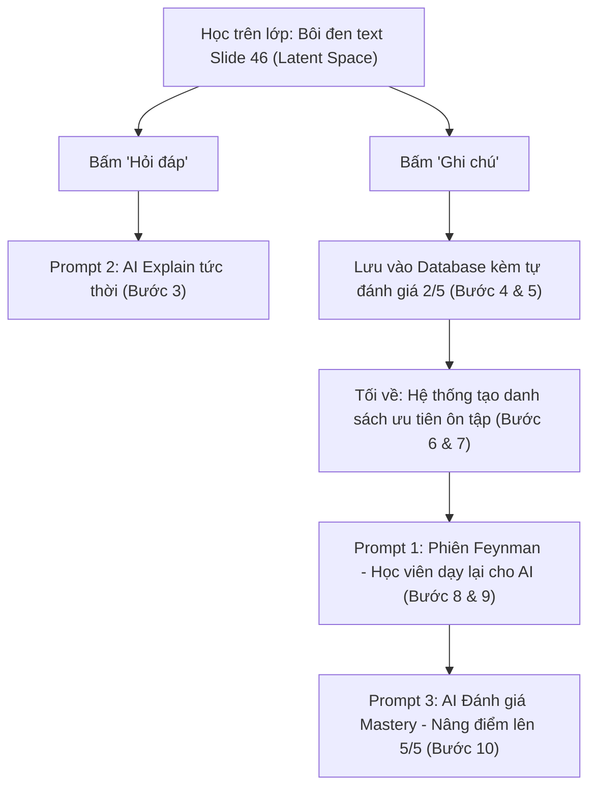

# 🧠 Kiến Trúc System Prompt — VLearn Smart Learning

Dự án: **VLearn Smart Workflow — Học trên lớp & Ôn tập cá nhân hóa cùng AI**  
Nhóm: **Tứ Đại Thiên Vương** · Batch 04 · Lớp 3A · Phòng E402  
Phân công đảm nhiệm: **Prompt Engineering & Trải nghiệm AI**  
Căn cứ dữ liệu bài giảng duy nhất: **Buổi 3: Prompt Engineering — Mô hình tạo sinh ảnh và video** (`data/Buoi3_PromptEngineering_v2_compressed.pdf` — 100 slides, TS. Đặng Tuấn Linh – Trường CNTT&TT, ĐHBK Hà Nội).

---

## 📌 Chuẩn cấu trúc 5 phần bắt buộc

Tất cả các System Prompt trong dự án đều tuân thủ nghiêm ngặt theo chuẩn cấu trúc:
1. **Identity** (Định danh & Vai trò nhân vật)
2. **Rules** (Nguyên tắc ứng xử & Phương pháp sư phạm)
3. **Capabilities** (Năng lực & Dữ liệu được phép truy cập)
4. **Constraints** (Ràng buộc, giới hạn & Xử lý ngoại lệ, Guardrails phòng vệ)
5. **Output format** (Định dạng đầu ra JSON chuẩn gồm các trường: `intent`, `action`, `reply`, `evidence_ids`)

---

## 📁 Danh mục các System Prompt trong hệ thống

| STT | Tên Prompt | Vai trò & Tính năng | Vị trí trong Prototype | Định dạng đầu ra |
|:---:|:---|:---|:---:|:---|
| **1** | [feynman_student_prompt.md](file:///d:/CODE/AITHUCCHIEN/LABS/K4-3A-E402-TuDaiThienVuong/prompts/feynman_student_prompt.md) | **AI Học viên tò mò (Linh hồn sản phẩm)** — Kích hoạt phương pháp Feynman & Socratic: học viên đóng vai Giáo viên dạy lại cho AI về cơ chế Diffusion Models, Latent Space, VAE, ComfyUI, LoRA | **Bước 8 & 9** *(Sau giờ học)* | JSON: `intent`, `action`, `reply`, `evidence_ids` |
| **2** | [inclass_explain_prompt.md](file:///d:/CODE/AITHUCCHIEN/LABS/K4-3A-E402-TuDaiThienVuong/prompts/inclass_explain_prompt.md) | **AI Giải thích tức thì trên lớp** — Giải thích nhanh khi học viên bôi đen khái niệm trên slide Buổi 3 trong giờ học (<150 từ, chuẩn 3 phần) | **Bước 3** *(Trong giờ học)* | JSON: `intent`, `action`, `reply`, `evidence_ids` |
| **3** | [mastery_evaluator_prompt.md](file:///d:/CODE/AITHUCCHIEN/LABS/K4-3A-E402-TuDaiThienVuong/prompts/mastery_evaluator_prompt.md) | **AI Đánh giá Mastery** — Chấm điểm câu trả lời, nâng điểm đánh giá từ 2/5 lên 4/5 hoặc 5/5, nhận xét khích lệ dựa trên tri thức Buổi 3 | **Bước 10** *(Sau giờ học)* | JSON: `intent`, `action`, `reply`, `evidence_ids` |

---

## 🎯 Bản đồ luồng trải nghiệm (Flow Mapping)

